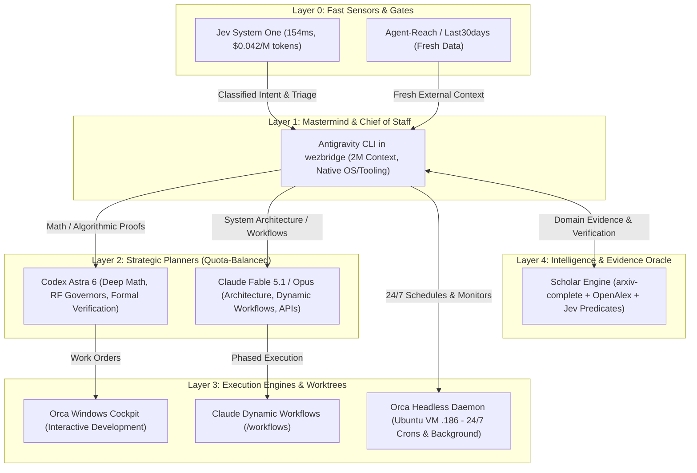

# Master Orchestration Roadmap: Autonomous Multi-Agent Infrastructure & Intelligence

> **Single Source of Truth** for the unified orchestration system: Mastermind architecture, dynamic quota routing, 24/7 remote execution on Orca, Jev System One gates, and the Scientific Literature Semantic Compiler.
>
> **Last Updated:** 2026-09-21
> **Repository:** `wezbridge` (Mastermind Hub / COO)
> **Status:** Active Execution

---

## 1. Executive Summary & System Hierarchy

The system transitions from ad-hoc session management to a **hierarchical, multi-tier autonomous operating system**. The local Windows workstation acts as the primary cockpit and experimentation bench, while 24/7 background tasks and long-running automations reside on dedicated headless servers (`Ubuntu VM 192.168.100.186`, `NAS .206`, `nodo01-03`).



---

## 2. Dynamic Model Routing & Quota Governance (Option B)

### Available Account Inventory
- **Claude Max (Account 1 & Account 2):** Resets weekly (typically Sunday night / Monday morning). Very high burst capacity, exceptional code architecture and workflow coordination.
- **Codex Max (Account 1):** Astra 6 (extreme reasoning, deep mathematical formalisms), Sol 5.6, Terra 5.
- **Antigravity (AGY):** Google Deepmind AGY 2.0 CLI with 2M token context, native IDE/system hooks, and zero rate-limit friction on planning turns.

### Routing Decision Engine
Routing is resolved dynamically based on **Weekly Quota Remaining** and **Task Complexity Domain**:

| Task Domain | Primary Model | Fallback Model | Routing Criteria |
| :--- | :--- | :--- | :--- |
| **Global Triage & Intent Detection** | Jev System One | AGY Flash | Latency < 200ms; structured JSON decision. |
| **Mastermind Coordination & COO** | Antigravity (AGY) | Claude Opus | Needs 2M context and local filesystem/git control. |
| **RF / Physical Math / Kernel Proofs** | Codex Astra 6 | Claude Opus | High-depth algorithmic proofs, MikroTik PCC math. |
| **API Contracts, Architecture, Workflows** | Claude Fable 5.1 / Opus | Codex Sol 5.6 | Clean design system, protocol definitions. |
| **Code Implementation Workers** | Codex Terra 5 / Claude Sonnet | Codex Sol | Autonomous single-pane execution in worktrees. |
| **24/7 Watchers & Scheduled Crons** | Headless Scripts / Hermes | Ubuntu VM Orca | Runs autonomously on `.186` without local GPU/CPU. |

---

## 3. Remote Orca Topology (24/7 Operations)

### The Problem Solved
Previously, running tasks on the Windows workstation required keeping the machine awake. If the PC slept or restarted, background daemons stalled.

### Architecture
1. **Ubuntu VM (`192.168.100.186`) Headless Server:**
   - Runs `orca serve` (headless daemon).
   - Executes background automations, Hermes agent tasks, Kuma heartbeats, and scheduled data pulls.
   - Bound to systemd: `systemctl enable --now orca-daemon`.
2. **Windows Desktop Cockpit:**
   - Connected to remote Orca instances via pairing link (`orca://pair?...`).
   - Gives 100% live observability into remote agent sessions, terminal logs, and resource usage with zero local memory penalty.
3. **Strict Separation of Custody:**
   - Tasks requiring infrastructure changes (ZFS, NAS, Coolify, Mikrotik, ESXi) are **exclusively delegated to the `infra` workspace** via A2A protocol.
   - The `wezbridge` orchestrator NEVER executes direct destructive infra commands.

---

## 4. The "Lethal Weapon": Scientific Literature Semantic Compiler

### Core Concept
Conventional RAG relies on vector similarity (`cos(query, chunk)`), which answers *"what text looks like my query?"* but cannot answer:
> *"Which published paper experimentally proved loaded latency reduction on real fixed wireless hardware without requiring Wi-Fi 6 PHY?"*

The **Scholar Engine** transforms 3.15M papers into an ultra-fast, queryable semantic database by combining **Jev System One (probabilistic decisions)** with open scholarly graphs.

```text
                  THE INTERNET AS OUR DATA LAKE
                               │
            ┌──────────────────┼─────────────────┐
          arXiv            OpenAlex        arxiv-complete (HF)
       API / search       Graph / API     3.15M Papers / LaTeX
            │                  │                 │
            └──────────────────┼─────────────────┘
                               ↓
                        DISCOVERY ENGINE
                  (BM25 + Semantic Scholar)
                               ↓
                         JEV GATEKEEPER
                (154ms Parallel Predicate Filter)
                               ↓
                       LAZY FETCHER (TeX)
                 (~68 KB text, no heavy PDFs)
                               ↓
              ┌────────────────┴────────────────┐
              ↓                                 ↓
         TEMP CACHE                       KNOWLEDGE DB
    (Raw paper text)               (PostgreSQL + pgvector)
                                   - Extracted Claims & Evidence
                                   - Materialized Semantic Bitmaps
                                   - Citation Verification Proofs
```

### Key Architectural Advantages
1. **Zero Storage Bloat:**
   - Do NOT download the 16 TB PDF/source corpus.
   - Query lightweight Hugging Face Parquet metadata (~1.6 GB) remotely using DuckDB HTTP range queries.
   - Fetch only resolved LaTeX text (~68 KB median) on the surviving ~40 papers.
2. **Reusable Semantic Predicates:**
   - Natural language conditions compile into persistent probabilistic posting lists:
     - `P_real_hardware > 0.85`
     - `P_mac_scheduler > 0.90`
     - `P_loaded_latency_evaluated > 0.80`
     - `P_simulation_only < 0.15`
   - Future queries reuse these materialized bitmaps (Roaring bitmaps in Postgres/DuckDB) with zero inference cost.
3. **Double Jev Gate (Pre-RAG & Post-RAG):**
   - **Pre-RAG:** Gates whether a paper is worth reading at all.
   - **Post-RAG:** Evaluates every claim generated by the reasoning LLM against the cited passage (`SUPPORTED`, `CONTRADICTED`, `INSUFFICIENT_EVIDENCE`). Hallucinations are strictly filtered out before reaching the user.
4. **Economic Efficiency:**
   - 3.15M abstracts evaluated across 50 Jev dimensions costs ~$33 to $53 total.
   - Gives the orchestrator superhuman research recall in under 2 seconds.

---

## 5. Phased Implementation Milestones

### Phase 1: Multi-Host Orca Environment & Infrastructure Guard
- [x] Migrate all active terminal workspaces from WezTerm to Orca Windows.
- [x] Deploy `orca serve` on Ubuntu VM `192.168.100.186` (`/etc/systemd/system/orca-daemon.service`).
- [x] Pair Windows Orca to Ubuntu VM remote server (`Ubuntu-VM-Homeserver` @ `192.168.100.186:6768`).
- [x] Establish systemd service on VM for persistent background agent execution (survives workstation reboot).
- [x] Ensure `wezbridge` A2A routing enforces strict boundary: all infra tasks route to `infra` pane.

### Phase 2: Jev Fast Routing Harness & Triage Gates
- [x] Implement `typesafe-mcp` and local Jev client adapter in Python (`scholar/jev/client.py`).
- [x] Integrate Ruben Hassid's 154ms System One harness for fast intent routing (`scripts/userprompt-routing-jev.cjs`).
- [x] Wire Jev into incoming user requests to classify task complexity, required model tier (Fast vs Deep), and domain.
- [x] Implement weekly quota monitor script checking Claude & Codex usage to auto-balance dispatching (`scripts/quota-dispatcher.cjs`, retired T-0582 — no live trigger found).

### Phase 3: Scholar Engine MVP (Scientific RAG & Predicates)
- [x] Scaffold `scholar-engine` repo / module (`scholar/core`, `scholar/sources`, `scholar/jev`).
- [x] Configure DuckDB remote querying over Hugging Face `arxiv-complete` Parquet files (`hf://datasets/secemp9/arxiv-complete/...`).
- [x] Integrate OpenAlex API for instant citation graph resolution without parsing raw LaTeX bibliographies.
- [x] Implement Jev predicate evaluation cache in SQLite (`scholar/core/predicates.py`).
- [x] Build CLI commands: `scholar search`, `scholar inspect`, `scholar research`.
- [x] Expose as MCP Server (`scholar.mcp.server`) and configured `.mcp.json` in `wezbridge` and `infra`.

### Phase 4: Full-Autonomous Knowledge Loop
- [ ] Connect Scholar Engine to WISP RF optimizer: feed real-world 802.11ac MAC scheduling papers to Codex Astra 6 for driver optimization.
- [ ] Connect Scholar Engine to AI memory research: continuously track breakthroughs in long-context agent memory and state compaction.
- [ ] Implement automated claim-evidence verification gate on all research deliverables.

### Phase 5: Autonomous Nightly Observability & Self-Healing Fleet
- [x] Auto-Curador Nocturno de Reclamos WISP (`dashboard/scripts/nightly-ticket-curator.js`) — cleans false technical tickets via live UISP/NMS telemetry.
- [x] Foreman Autonomous Supervisor (`wezbridge/scripts/orchestration/foreman.py`) — JEV-based terminal watcher, 3-strike nudge ceiling, verified test gating.
- [x] Pre-PR Safety Guard (`infra/scripts/git/jev_pre_pr_guard.py`) — fail-closed protection for airOS chanbw, RouterOS buffer queues, and destructive SQL.
- [x] Native Orca Automations registered and scheduled:
  - `Auto-Curador Nocturno WISP` (Daily 04:30 ART)
  - `Foreman Fleet Watcher` (Daily 05:00 ART)
- [x] WISP RF fleet health audit script committed and scheduled in `wisp-cron` (`04:00 ART`).
- [ ] Nominal test regression watcher with isolated re-runs (`recorrerSolos`) against `known-red-suites.json`.

### Phase 6: Continuous Code Intelligence, Incremental Audits & UI Battle Testing
- [ ] **Automated GitNexus Code Graph Refresh:**
  - Nightly scheduled run of `npx gitnexus analyze --embeddings` on active repositories (`wezbridge`, `whatsappbot-main-wt`, `infra`).
  - Gated by commit hash: runs only if `HEAD != last_analyzed_commit` to preserve compute and disk life.
- [ ] **Checkpoint-Based Incremental Audit (Audit-Diff):**
  - Tracks last audited revision in `_intel/audit-checkpoint.json`.
  - Runs targeted security and architecture audits strictly on `git diff <checkpoint>..HEAD`.
  - Emits alerts only on *new* regressions, preventing false noise from historical baseline issues.
- [ ] **Scoped UI/UX Responsive Battle Test:**
  - Automated Playwright runner triggered when diffs touch frontend components (`.tsx`, `.jsx`, `.css`, `components/`).
  - Audits 3 standardized device viewports: Mobile (iPhone 15 Pro - 393x852), Tablet (iPad Air - 820x1180), Desktop (1920x1080).
  - Validates zero horizontal overflow (`scrollWidth > clientWidth`), accessible touch targets, and zero browser console errors.
- [ ] **Operational Audit Cadence:**
  - **Incremental Audit (Diff-Only):** Daily @ 03:15 ART (< 30 seconds).
  - **Full Monorepo Audit:** Weekly on Sundays @ 02:00 ART (aligned with `MAINTENANCE-WEEKLY.md`).
- [ ] **MemoryMaster Background Steward:**
  - Weekly autonomous execution of `run_steward` and `compact_memory` in MemoryMaster to prune obsolete claims and recompute memory tiers.

---

## 6. Verification & Evidence Contract

1. **Autonomous Operation:** All steps, tests, and deployments are executed directly by the agent without asking the user to run commands.
2. **Reversibility & Isolation:** Background tasks run in isolated worktrees and containers.
3. **No Phantom Delivery:** Changes must be verified by live execution logs, unit test suites, and validated network endpoints before being marked complete.

